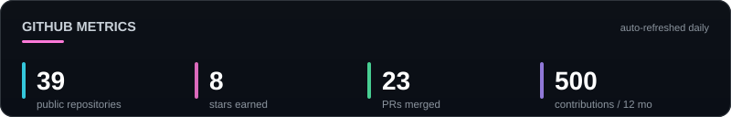
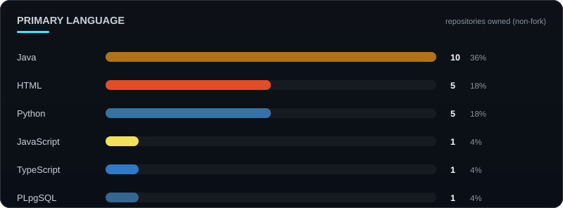
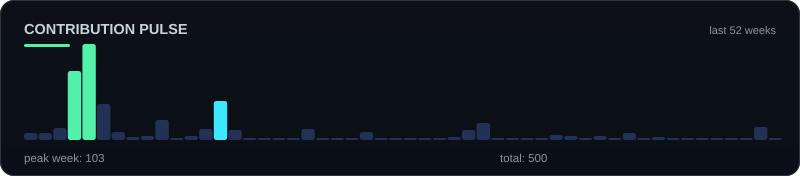

Art — <a href="https://imgur.com/gallery/escape-kurokotei-vzwzpZ7">“Escape” by Kurokotei</a>

 

### Moseyuh333

Information-security student at HCMUTE, but most of what I do is building software. Rust, Python, Kotlin, Java — whatever the project needs. I like things that run end to end: a protocol that routes, a tool that automates, an app that just works.

 

## 📦 projects

| | |
|---|---|
| [**Never_been_found**](https://github.com/Moseyuh333/Never_been_found) · Rust | Anonymous routing protocol — hybrid post-quantum crypto (X25519 + ML-KEM-768), Kademlia DHT, 1-round-trip circuits. Research MVP, 27 tests. |
| [**Skill_collector**](https://github.com/Moseyuh333/Skill_collector) · Python | Scan, score, virus-check and install AI agent skills from GitHub into agentic IDEs. |
| [**Background-player**](https://github.com/Moseyuh333/Background-player) · Kotlin | Android media player that keeps audio alive across apps and screen-off. |
| [**JVA-bookstore**](https://github.com/Moseyuh333/JVA-bookstore) · Java + PL/pgSQL | Full-stack bookstore e-commerce on a real database. |
| [**Network-Incident-Response-Orchestrator**](https://github.com/Moseyuh333/Network-Incident-Response-Orchestrator) · Python | SOAR-style pipeline — automated detect → contain → analyze. |
| [**nasm_pj**](https://github.com/Moseyuh333/nasm_pj) · Assembly | x86 experiments — memory layout, syscalls, low-level fundamentals. |
| [**OmniRoute**](https://github.com/diegosouzapw/OmniRoute) · open source | Free AI gateway (65k★) — merged PRs across chaos mode and skill tooling. |

Also: [Web](https://moseyuh333.github.io/Web/) — personal portfolio, and a pile of university coursework in the repo list above it.

## 📈 numbers, not noise

<b>more graphs — 3D calendar &amp; snake</b>

 

---

Crafted in dark mode — “are u ok?” on loop.

