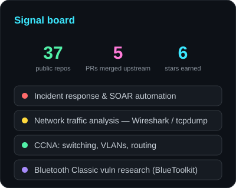

### Moseyuh333

Sinh viên An toàn thông tin — HCMUTE. Học nghe ngóng network, chuyên về **incident response** và mọi thứ chạy qua dây mạng. Code chỉ là công cụ — dùng khi cần, giật gôn khi xong.

## mình làm gì

Network security là mảng chính — cụ thể là những giờ ngồi với Wireshark/tcpdump, dựng lab, viết script tự động hoá phần nhàm chán của incident response. CCNA đã học, đang đi sâu hơn về traffic analysis và vulnerability research (gần đây nghiện Bluetooth Classic security).

Python là cây dao đa năng — đủ để viết orchestrator, dashboard, OCR tool, hoặc thứ gì đó tự hoá việc quét agent skills. Java/Kotlin xuất hiện khi môn học bắt buộc. Assembly chỉ để hiểu exploit hoạt động thế nào.

## 🔬 security

| | |
|---|---|
| [**Network-Incident-Response-Orchestrator**](https://github.com/Moseyuh333/Network-Incident-Response-Orchestrator) | Orchestrator kiểu SOAR — tự động hoá pipeline detect → contain → analyze sự cố mạng |
| [**SecBase**](https://github.com/Moseyuh333/SecBase) | Security suite chạy local: dashboard theo dõi posture + threat-intel digest hàng ngày |
| [**simple_phishing**](https://github.com/Moseyuh333/simple_phishing) | Demo phishing bằng HTML5 Fullscreen API — dùng cho bài thuyết trình nhận thức bảo mật |
| [**nasm_pj**](https://github.com/Moseyuh333/nasm_pj) | Thí nghiệm x86 assembly — hiểu memory & exploit từ tầng thấp |
| [BlueToolkit](https://github.com/Moseyuh333/BlueToolkit) | Fork để nghiên cứu Bluetooth Classic vuln testing |

## 🧰 side quests

| | |
|---|---|
| [**screenshot_based_ai_desktop_assistant**](https://github.com/Moseyuh333/screenshot_based_ai_desktop_assistant) | Chụp màn hình → PaddleOCR → hỏi LLM ngay tại chỗ *(có contribution riêng trên fork)* |
| [**Skill_collector**](https://github.com/Moseyuh333/Skill_collector) | Tự động thu thập/chấm điểm/quét virus agent skills từ GitHub — được merge vào OmniRoute upstream |
| [**JVA-bookstore**](https://github.com/Moseyuh333/JVA-bookstore)  | E-commerce bookstore — Java + PL/pgSQL |
| [**Background-player**](https://github.com/Moseyuh333/Background-player)  | Android media player chạy nền — Kotlin |
| [HonKuiMushiGD](https://github.com/Moseyuh333/HonKuiMushiGD) | Clone game Bookworm viết lại bằng Godot |

## 🤝 open source

[OmniRoute](https://github.com/diegosouzapw/OmniRoute) — AI gateway 231+ providers. **5 PRs đã merge** ([#6186](https://github.com/diegosouzapw/OmniRoute/pull/6186) · [#6294](https://github.com/diegosouzapw/OmniRoute/pull/6294) · [#6728](https://github.com/diegosouzapw/OmniRoute/pull/6728) · [#7781](https://github.com/diegosouzapw/OmniRoute/pull/7781) · [#8264](https://github.com/diegosouzapw/OmniRoute/pull/8264)), còn [#12719](https://github.com/diegosouzapw/OmniRoute/pull/12719) đang review.

## 📊

 

## 🎯 đang làm

- **Medical-for-Future** — thiết bị health monitoring (Arduino UNO Q + MAX30102/MPU6050) có Edge AI, project riêng 🔒
- Đọc tài liệu về incident response playbooks khi rảnh
- Cà phê + lofi + tcpdump -A, combo hoàn hảo

